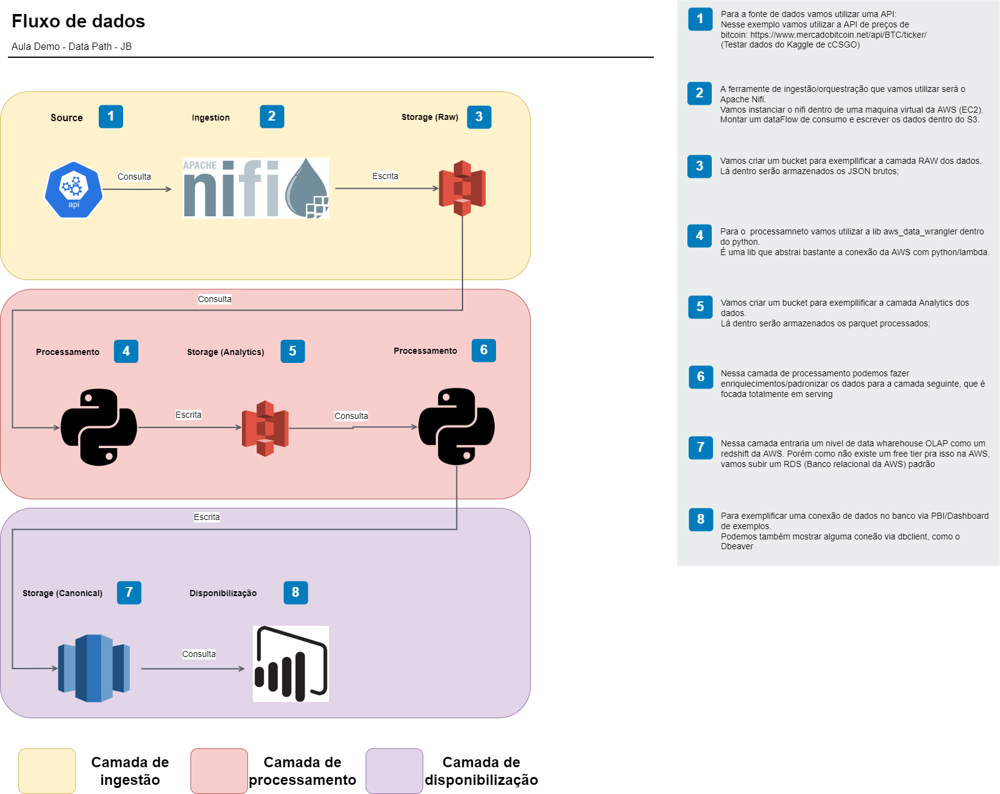

# Introducao

Nesse momento vamos montar um fluxo completo de ponta a ponta de ingestao de dados, processamento de dados e disponibilização.

# Fluxo de dados



# Pre requisitos:

## Conta AWS

Possuir uma conta AWS (Com o primeiro ano da conta, não será gasto com nenhum recurso)

### EC2

#### Configurando Nifi

Se formos instanciar o apache nifi na nuvem é necessário criar a sua role anteriormente.
Foi atachada a permissão de S3FullAcess a role

Tanto a Key de acesso quanto o Security group podemos criar on demand conforme subimos a máquina. Em relação a parte de redes, utilizaremos as cinfigurações padrões da conta para isso.


baixar a key de acesso ssh da maquina e converter a .pem para .ppk utilizando o puttygen, para acesso via putty

```shell
$wget https://dlcdn.apache.org/nifi/1.16.0/nifi-1.16.0-bin.tar.gz
$sudo yum install java -y
$tar -zxvf nifi-1.16.0-bin.tar.gz
$sudo /home/ec2-user/nifi-1.16.0/bin/nifi.sh install
```

Alterar os campos do nifi.properties dentro do arquivo de conf:
- nifi.web.https.host: IP Privado aws (172.....)
- nifi.web.proxy.host: IP Interno aws (18....:8443)

```shell
$sudo service nifi start
```

Dentro do arquivo de log do nifi-app.log haverá os usuarios e senha raiz para logar.

#### Montando fluxo de teste Nifi

